```mermaid
flowchart LR
    subgraph trusted ["Trusted application subnet"]
        app["⚙️ Backend app / ETL\n(Python · Java · Go · .NET)"]
        shell["🖥️ cypher-shell"]
    end

    subgraph platform ["Platform / K8s cluster"]
        lb["L4 Load Balancer\nor NodePort\n(TCP :7687)"]
        neo4j_b["Neo4j\nBolt :7687"]
    end

    app -- "Bolt TCP/TLS :7687" --> lb
    shell -- "Bolt TCP/TLS :7687" --> lb
    lb -- "Bolt TCP :7687" --> neo4j_b

    style app fill:#fff3e0,stroke:#f57c00
    style shell fill:#f3e5f5,stroke:#7b1fa2
    style lb fill:#c8e6c9,stroke:#2e7d32
    style neo4j_b fill:#fce4ec,stroke:#c62828
```

# Neo4j Client Access Patterns — Enterprise Guide

> How to expose Neo4j securely in enterprise environments (Kubernetes, OpenShift, on‑prem, cloud).
> This document describes two network patterns. They address different client types and constraints — use one or both depending on your context.

---

## 1 — Neo4j network fundamentals

Neo4j exposes **two distinct network channels**. Every access pattern ultimately maps to one or both of them.

| Channel | Protocol | Default port | Used by |
|---------|----------|:---:|---------|
| **Web** | HTTP / HTTPS | 7474 / 7473 | Neo4j Browser UI, HTTP API |
| **Bolt** | Bolt (binary) over TCP | 7687 | Official drivers (Python, Java, Go, .NET, JS), `cypher-shell` |

> **Key fact — Bolt over WebSocket.**
> Browsers cannot open raw TCP sockets.
> To let browser-based tools (Neo4j Browser, Bloom, NeoDash) talk Bolt, the **JavaScript driver** wraps Bolt inside a **WebSocket** (WS / WSS).
> All other drivers (Python, Java, Go, .NET) and `cypher-shell` use **Bolt over TCP only**.

---

## 2 — Who connects how?

```mermaid
flowchart TB
    subgraph clients ["Clients"]
        direction TB
        browser["🌐 Web browsers\n(Neo4j Browser · Bloom · NeoDash)"]
        apps["⚙️ Backend applications\n(Python · Java · Go · .NET drivers)"]
        cli["🖥️ Ops tools\n(cypher-shell)"]
    end

    subgraph transport ["Transport layer"]
        direction TB
        https_ws["HTTPS + Bolt‑over‑WSS\n(port 443 via L7 proxy)"]
        bolt_tcp["Bolt over TCP/TLS\n(port 7687)"]
    end

    subgraph neo ["Neo4j instance(s)"]
        direction TB
        web_ep["Web endpoint\nHTTP :7474 · HTTPS :7473"]
        bolt_ep["Bolt endpoint\n:7687"]
    end

    browser -->|"HTTPS + WSS"| https_ws
    apps -->|"Bolt TCP"| bolt_tcp
    cli -->|"Bolt TCP"| bolt_tcp

    https_ws -->|"HTTP(S) internally"| web_ep
    https_ws -->|"Bolt TCP internally"| bolt_ep
    bolt_tcp --> bolt_ep

    style browser fill:#e1f5fe,stroke:#0288d1
    style apps fill:#fff3e0,stroke:#f57c00
    style cli fill:#f3e5f5,stroke:#7b1fa2
    style https_ws fill:#e8f5e9,stroke:#388e3c
    style bolt_tcp fill:#e8f5e9,stroke:#388e3c
    style web_ep fill:#fce4ec,stroke:#c62828
    style bolt_ep fill:#fce4ec,stroke:#c62828
```

**The fundamental split:**

| Client type | Needs Web channel? | Needs Bolt? | Transport | Can go through L7 / HTTP proxy? |
|---|:---:|:---:|---|:---:|
| Neo4j Browser / Bloom / NeoDash | Yes (UI) | Yes (queries via WSS) | HTTPS + Bolt‑over‑WebSocket | **Yes** |
| Python / Java / Go / .NET driver | No | Yes | Bolt over TCP/TLS | **No** (TCP only) |
| `cypher-shell` | No | Yes | Bolt over TCP/TLS | **No** (TCP only) |

---

## 3 — Two enterprise patterns

Depending on client types and network constraints, an enterprise may deploy **Pattern A alone**, **Pattern B alone**, or **both together**.

```mermaid
flowchart LR
    subgraph external ["Outside platform network"]
        ext_user["👤 Users · Partners\nBrowser-based tools\n(443‑only zones)"]
    end

    subgraph internal ["Trusted application subnet"]
        int_app["⚙️ Backend apps · ETL\ncypher-shell"]
    end

    subgraph platform ["Platform / Kubernetes"]
        proxy["🔒 Pattern A\nFront door +\nNeo4j reverse proxy\n(port 443)"]
        lb4["🔓 Pattern B\nDirect Bolt\nexposure\n(port 7687)"]
        neo["🗄️ Neo4j\n:7473 · :7474 · :7687"]
    end

    ext_user -- "HTTPS 443" --> proxy
    int_app -- "Bolt TCP 7687" --> lb4

    proxy -- "HTTP + Bolt TCP\n(internal)" --> neo
    lb4 -- "Bolt TCP\n(internal)" --> neo

    style ext_user fill:#e1f5fe,stroke:#0288d1
    style int_app fill:#fff3e0,stroke:#f57c00
    style proxy fill:#c8e6c9,stroke:#2e7d32
    style lb4 fill:#c8e6c9,stroke:#2e7d32
    style neo fill:#fce4ec,stroke:#c62828
```

---

## 4 — Pattern A: Front door + Neo4j reverse proxy

### Goal

Keep **all cluster nodes private**, expose **one controlled entry point** on port **443 only**.

### When to use

- Clients are **outside** the platform network (external users, partners, 443-only zones).
- Security requires a **single audited ingress** (TLS policy, allowlists, WAF, logging).
- Publishing internal node addresses or non-standard ports is not acceptable.

### How it works

```mermaid
flowchart LR
    subgraph external ["External network"]
        user["🌐 Browser user"]
    end

    subgraph edge ["Edge / Ingress"]
        gw["Enterprise gateway\n(F5 · AWS ALB · HAProxy)"]
    end

    subgraph cluster ["Platform / K8s cluster"]
        rp["Neo4j Reverse Proxy\n(Helm: neo4j/neo4j-reverse-proxy)\n\n① Routes HTTP → Web endpoint\n② Routes Bolt‑WSS → Bolt endpoint\n③ Rewrites Bolt port 7687 → 443\n    in server responses"]
        neo4j_a["Neo4j\nWeb :7473/:7474\nBolt :7687"]
    end

    user -- "HTTPS :443\n(web UI + Bolt‑over‑WSS)" --> gw
    gw -- ":443" --> rp
    rp -- "HTTP :7474" --> neo4j_a
    rp -- "Bolt TCP :7687" --> neo4j_a

    style user fill:#e1f5fe,stroke:#0288d1
    style gw fill:#e0e0e0,stroke:#616161
    style rp fill:#c8e6c9,stroke:#2e7d32
    style neo4j_a fill:#fce4ec,stroke:#c62828
```

### Critical detail: Bolt port rewriting

The official `neo4j/neo4j-reverse-proxy` Helm chart does more than simple routing. When Neo4j responds to a Bolt handshake, it advertises its Bolt port (7687) in the response. The reverse proxy **rewrites this port to 80 or 443** so that the browser client reconnects through the proxy, not directly to the internal port.

Without this rewriting, browser clients would attempt to open a WebSocket on port 7687 — which the proxy / Ingress does not expose.

### Pros

- Minimal exposed surface: one hostname, one port (443)
- Strong governance: TLS termination, allowlists, and audit at the edge
- Internal addresses and ports never leak to clients

### Cons

- Extra component to operate and keep HA
- Limited to browser-based clients — `cypher-shell` and non-JS drivers need Bolt over TCP, which HTTP-based Ingress cannot carry (see Pattern B if this access is also required)

### Kubernetes implementation

| Component | Maps to |
|---|---|
| Enterprise gateway | Nginx Ingress Controller / HAProxy Ingress |
| Neo4j reverse proxy | Helm chart `neo4j/neo4j-reverse-proxy` |
| Neo4j service | ClusterIP Service (7474 + 7687) |

---

## 5 — Pattern B: Direct Bolt over TCP

### Goal

Provide the most direct path to Bolt — no proxy, no WebSocket wrapping.

### When to use

- Clients run inside a **protected subnet / VLAN / VPC** with explicit network allowlisting to the DB subnet.
- High-throughput or latency-sensitive workloads (ETL, batch imports, real-time services).
- Using **any** official driver (Python, Java, Go, .NET) or `cypher-shell`.
- No browser-based UI access is needed, **or** browser access is handled separately via Pattern A.

### How it works

### Pros

- Most direct path — best latency and throughput
- Fewest moving parts
- Supports **all** drivers and `cypher-shell`
- Aligns with classic database access patterns

### Cons

- Requires explicit **firewall rules** between subnets
- In cluster mode, requires correct **advertised addresses** (see Section 7)

### Kubernetes implementation

| Component | Maps to |
|---|---|
| L4 Load Balancer | `LoadBalancer` Service (type: LoadBalancer, TCP) or `NodePort` |
| Neo4j service | Pod port 7687 |

---

## 6 — Combined architecture

When both browser-based and backend/CLI access are required, the two patterns can coexist within the same platform:

```mermaid
flowchart TB
    subgraph external ["External / 443‑only zone"]
        browser_user["🌐 Browser users\n(Neo4j Browser · Bloom · NeoDash)"]
    end

    subgraph trusted ["Trusted application subnet / VPN"]
        backend["⚙️ Backend services · ETL"]
        ops["🖥️ cypher-shell (ops)"]
    end

    subgraph k8s ["Kubernetes / Platform"]
        direction TB

        subgraph ingress_layer ["Ingress layer"]
            ing["Ingress Controller\n:443"]
        end

        subgraph proxy_layer ["Reverse proxy layer"]
            rp2["neo4j/neo4j-reverse-proxy\n(port rewriting 7687→443)"]
        end

        subgraph bolt_layer ["Direct Bolt exposure"]
            lb_bolt["L4 LB · NodePort\nTCP :7687"]
        end

        subgraph data_layer ["Data layer"]
            neo["🗄️ Neo4j\nWeb :7473/:7474\nBolt :7687"]
        end

        ing --> rp2
        rp2 -- "HTTP :7474" --> neo
        rp2 -- "Bolt TCP :7687" --> neo
        lb_bolt -- "Bolt TCP :7687" --> neo
    end

    browser_user -- "HTTPS + WSS :443\n(Pattern A)" --> ing
    backend -- "Bolt TCP :7687\n(Pattern B)" --> lb_bolt
    ops -- "Bolt TCP :7687\n(Pattern B)" --> lb_bolt

    style browser_user fill:#e1f5fe,stroke:#0288d1
    style backend fill:#fff3e0,stroke:#f57c00
    style ops fill:#f3e5f5,stroke:#7b1fa2
    style ing fill:#e0e0e0,stroke:#616161
    style rp2 fill:#c8e6c9,stroke:#2e7d32
    style lb_bolt fill:#c8e6c9,stroke:#2e7d32
    style neo fill:#fce4ec,stroke:#c62828
```

| Access path | Who | Port | Transport | Via |
|---|---|:---:|---|---|
| Pattern A | Browser-based users (Browser, Bloom, NeoDash) | 443 | HTTPS + Bolt‑over‑WSS | Ingress → reverse proxy → Neo4j |
| Pattern B | Backend apps, ETL, cypher-shell | 7687 | Bolt over TCP/TLS | L4 LB → Neo4j |
| Internal cluster | Same-cluster pods | 7687 | Bolt over TCP | ClusterIP Service → Neo4j |

---

## 7 — Operational notes

### 7.1 — Advertised addresses (cluster mode)

When Neo4j runs as a **cluster**, drivers fetch a **routing table** containing the addresses of all cluster members. Each member advertises its address via `server.bolt.advertised_address`.

If these addresses are not reachable from the client's network, connections fail after the initial handshake.

**For Pattern A:** the reverse proxy handles this — it rewrites addresses in responses.

**For Pattern B:** you must ensure that every cluster member's `server.bolt.advertised_address` resolves to an address reachable from the trusted subnet. This typically means:
- Dedicated `LoadBalancer` or `NodePort` per member, **or**
- DNS entries pointing to each pod's external IP, **or**
- Using the Neo4j headless service (`neo4j-cluster-headless-service` chart) if clients are inside the same Kubernetes cluster.

### 7.2 — cypher-shell cannot go through HTTP Ingress

`cypher-shell` uses Bolt over raw TCP. Standard Kubernetes Ingress is an L7 (HTTP) construct and **cannot carry TCP traffic**.

The official Neo4j documentation acknowledges this directly:
> *"Cypher Shell expects a TCP connection and Ingress is an HTTP connection."*

**Options:**
- **Pattern B**: expose Bolt via a dedicated TCP LoadBalancer — simplest approach.
- **Nginx Ingress TCP ConfigMap**: expose an arbitrary TCP port through Ingress (e.g., map port 9000 → Neo4j :7687). This works but adds complexity and non-standard port mapping.

### 7.3 — TLS considerations

| Segment | TLS option |
|---|---|
| Client → Edge gateway | TLS termination at the edge (standard) |
| Edge → Reverse proxy | Re-encrypt or plain HTTP (cluster-internal) |
| Client → Neo4j (Pattern B) | `bolt+s://` (verified TLS) or `bolt+ssc://` (self-signed) |
| Neo4j native TLS | `server.bolt.tls_level` = `REQUIRED` (recommended for production) |

### 7.4 — Security reminder for WSS access

When browser-based tools connect via WebSocket (Pattern A), the **full database is queryable** — the same as a direct Bolt connection. The only access control is **Neo4j authentication and role-based access**. Do not assume that "web-only" access is less powerful than Bolt.

---

## 8 — Decision guide

### Which pattern(s) do you need?

| Situation | Pattern |
|---|---|
| Only browser-based users need access (Browser, Bloom, NeoDash), no backend apps or cypher-shell | **A only** |
| Only backend applications and ops tools need access, no browser-based UI required | **B only** |
| Browser-based users **and** backend apps / cypher-shell both need access | **A + B** |
| All clients are inside the same Kubernetes cluster (no external access) | **B only** (ClusterIP is enough) |

### Comparison

| Criterion | Pattern A (Front door + proxy) | Pattern B (Direct Bolt) |
|---|---|---|
| **Client type** | Browser-based (JS driver over WSS) | Any driver, cypher-shell |
| **Network zone** | External / 443-only / untrusted | Trusted subnet / VPN / same cluster |
| **Exposed ports** | 443 only | 7687 (or custom) |
| **Latency** | +1 hop (proxy) | Minimal |
| **Driver support** | JS driver (browser) only | All (Python, Java, Go, .NET, JS, cypher-shell) |
| **Cluster routing** | Handled by reverse proxy rewriting | Requires correct advertised addresses |
| **Complexity** | Medium (proxy + Ingress) | Low (LB + firewall rules) |
| **Typical use case** | User-facing web tools, partner access | ETL, backend services, ops tooling |

The right choice depends on your client types and network constraints — one pattern may be sufficient, or both may be needed side by side.

---

## 9 — References

| Topic | Link |
|---|---|
| Reverse proxy chart & Ingress setup | https://neo4j.com/docs/operations-manual/current/kubernetes/accessing-neo4j-ingress/ |
| Ports & advertised addresses | https://neo4j.com/docs/operations-manual/current/configuration/ports/ |
| Bolt protocol (TCP + WebSocket) | https://neo4j.com/docs/bolt/current/bolt/ |
| JS driver in browser (WebSockets) | https://neo4j.com/docs/javascript-manual/current/browser-websockets/ |
| SSL/TLS framework | https://neo4j.com/docs/operations-manual/current/security/ssl-framework/ |
| Cluster routing & load balancing | https://neo4j.com/docs/operations-manual/current/clustering/setup/routing/ |
