```mermaid
flowchart LR
    subgraph clients ["Clients"]
        browser2["🌐 Web browsers\n(Neo4j Browser · Bloom · NeoDash)"]
        app2["⚙️ Backend apps / cypher-shell"]
    end

    subgraph platform ["Platform / K8s cluster"]
        lb2["LoadBalancer Service\n:7473 (HTTPS)\n:7687 (Bolt)"]
        neo4j_s["Neo4j\nWeb :7473\nBolt :7687"]
    end

    browser2 -- "HTTPS :7473" --> lb2
    app2 -- "Bolt TCP :7687" --> lb2
    lb2 -- ":7473" --> neo4j_s
    lb2 -- ":7687" --> neo4j_s

    style browser2 fill:#e1f5fe,stroke:#0288d1
    style app2 fill:#fff3e0,stroke:#f57c00
    style lb2 fill:#c8e6c9,stroke:#2e7d32
    style neo4j_s fill:#fce4ec,stroke:#c62828
```

```mermaid
flowchart LR
    subgraph trusted ["Trusted application subnet"]
        app["⚙️ Backend app / ETL\n(Python · Java · Go · .NET)"]
        shell["🖥️ cypher-shell"]
    end

    subgraph platform ["Platform / K8s cluster"]
        lb["L4 Load Balancer\nor NodePort\n(TCP :7687)"]
        neo4j_b["Neo4j\nBolt :7687"]
    end

    app -- "Bolt TCP/TLS :7687" --> lb
    shell -- "Bolt TCP/TLS :7687" --> lb
    lb -- "Bolt TCP :7687" --> neo4j_b

    style app fill:#fff3e0,stroke:#f57c00
    style shell fill:#f3e5f5,stroke:#7b1fa2
    style lb fill:#c8e6c9,stroke:#2e7d32
    style neo4j_b fill:#fce4ec,stroke:#c62828
```

# Neo4j Client Access Patterns — Enterprise Guide

> How to expose Neo4j securely in enterprise environments (Kubernetes, OpenShift, on‑prem, cloud).
> This document describes three network patterns. They address different client types and constraints — use one or combine them depending on your context.

---

## 1 — Neo4j network fundamentals

Neo4j exposes **two distinct network channels**. Every access pattern ultimately maps to one or both of them.

| Channel | Protocol | Default port | Used by |
|---------|----------|:---:|---------|
| **Web** | HTTP / HTTPS | 7474 / 7473 | Neo4j Browser UI, HTTP API |
| **Bolt** | Bolt (binary) over TCP | 7687 | Official drivers (Python, Java, Go, .NET, JS), `cypher-shell` |

> **Key fact — Bolt over WebSocket.**
> Browsers cannot open raw TCP sockets.
> To let browser-based tools (Neo4j Browser, Bloom, NeoDash) talk Bolt, the **JavaScript driver** wraps Bolt inside a **WebSocket** (WS / WSS).
> All other drivers (Python, Java, Go, .NET) and `cypher-shell` use **Bolt over TCP only**.

---

## 2 — Who connects how?

```mermaid
flowchart TB
    subgraph clients ["Clients"]
        direction TB
        browser["🌐 Web browsers\n(Neo4j Browser · Bloom · NeoDash)"]
        apps["⚙️ Backend applications\n(Python · Java · Go · .NET drivers)"]
        cli["🖥️ Ops tools\n(cypher-shell)"]
    end

    subgraph transport ["Transport layer"]
        direction TB
        https_ws["HTTPS + Bolt‑over‑WSS\n(port 443 via L7 proxy)"]
        bolt_tcp["Bolt over TCP/TLS\n(port 7687)"]
    end

    subgraph neo ["Neo4j instance(s)"]
        direction TB
        web_ep["Web endpoint\nHTTP :7474 · HTTPS :7473"]
        bolt_ep["Bolt endpoint\n:7687"]
    end

    browser -->|"HTTPS + WSS"| https_ws
    apps -->|"Bolt TCP"| bolt_tcp
    cli -->|"Bolt TCP"| bolt_tcp

    https_ws -->|"HTTP(S) internally"| web_ep
    https_ws -->|"Bolt TCP internally"| bolt_ep
    bolt_tcp --> bolt_ep

    style browser fill:#e1f5fe,stroke:#0288d1
    style apps fill:#fff3e0,stroke:#f57c00
    style cli fill:#f3e5f5,stroke:#7b1fa2
    style https_ws fill:#e8f5e9,stroke:#388e3c
    style bolt_tcp fill:#e8f5e9,stroke:#388e3c
    style web_ep fill:#fce4ec,stroke:#c62828
    style bolt_ep fill:#fce4ec,stroke:#c62828
```

**The fundamental split:**

| Client type | Needs Web channel? | Needs Bolt? | Transport | Can go through L7 / HTTP proxy? |
|---|:---:|:---:|---|:---:|
| Neo4j Browser / Bloom / NeoDash | Yes (UI) | Yes (queries via WSS) | HTTPS + Bolt‑over‑WebSocket | **Yes** |
| Python / Java / Go / .NET driver | No | Yes | Bolt over TCP/TLS | **No** (TCP only) |
| `cypher-shell` | No | Yes | Bolt over TCP/TLS | **No** (TCP only) |

---

## 3 — Three enterprise patterns at a glance

Depending on client types, network constraints, and security requirements, an enterprise may deploy **one pattern alone** or **combine several**.

```mermaid
flowchart TB
    subgraph patterns ["Patterns"]
        direction LR
        simple["🟢 Simple LB\nDirect exposure\nports 7473 + 7687\n\nAll client types\nLowest complexity"]
        pa["🔒 Pattern A\nFront door +\nreverse proxy\nport 443 only\n\nBrowser clients\n443‑only zones"]
        pb["🔓 Pattern B\nDirect Bolt TCP\nport 7687\n\nBackend apps\nTrusted subnet"]
    end

    simple ~~~ pa ~~~ pb

    style simple fill:#e8f5e9,stroke:#2e7d32
    style pa fill:#e3f2fd,stroke:#1565c0
    style pb fill:#fff3e0,stroke:#ef6c00
```

| Pattern | Exposed ports | Client types | Complexity | Typical context |
|---|---|---|---|---|
| **Simple LB** | 7473 + 7687 | All | Low | Internal / dev / non-standard ports OK |
| **A — Front door + proxy** | 443 only | Primarily browser-based (WSS) | Medium | External access, 443-only requirement |
| **B — Direct Bolt TCP** | 7687 | All drivers, cypher-shell | Low | Trusted subnet, performance path |
| **A + B combined** | 443 + 7687 | All | Medium-High | Mixed external + internal access |

---

## 4 — Simple LoadBalancer (direct exposure)

### Goal

Expose Neo4j's native ports directly — the **simplest possible configuration** with no intermediate components.

### When to use

- Exposing non-standard ports (7473, 7687) is acceptable in the network.
- Environment is **internal**, behind a VPN, or does not have strict "443-only" policies.
- Dev / test environments, or production where simplicity is prioritized over edge governance.
- All client types need access (browser UI, drivers, cypher-shell) through a single entry point.

### How it works

### Pros

- Simplest setup — no proxy, no Ingress, no extra components
- Supports **all** client types natively (browsers connect over HTTPS + native Bolt-over-WS on :7687, drivers over Bolt TCP, cypher-shell)
- TLS handled by Neo4j itself (native SSL configuration)
- Easy to troubleshoot — direct connection, no intermediate rewriting

### Cons

- Exposes **non-standard ports** (7473, 7687) — may be blocked by corporate firewalls or proxy rules
- No centralized edge governance (no WAF, no allowlist at Ingress level)
- TLS certificates must be managed **inside Neo4j** configuration, not at an edge gateway
- In cluster mode, same advertised-address considerations as Pattern B (see Section 9.1)

### Kubernetes implementation

| Component | Maps to |
|---|---|
| LoadBalancer | `LoadBalancer` Service exposing ports 7473 + 7687 |
| Neo4j | Pod with native HTTPS (:7473) and Bolt (:7687) enabled |

---

## 5 — Pattern A: Front door + Neo4j reverse proxy

### Goal

Keep **all cluster nodes private**, expose **one controlled entry point** on port **443 only**.

### When to use

- Clients are **outside** the platform network (external users, partners, 443-only zones).
- Security requires a **single audited ingress** (TLS policy, allowlists, WAF, logging).
- Publishing internal node addresses or non-standard ports is not acceptable.

### How it works

```mermaid
flowchart LR
    subgraph external ["External network"]
        user["🌐 Browser user"]
    end

    subgraph edge ["Edge / Ingress"]
        gw["Enterprise gateway\n(F5 · AWS ALB · HAProxy)"]
    end

    subgraph cluster ["Platform / K8s cluster"]
        rp["Neo4j Reverse Proxy\n(Helm: neo4j/neo4j-reverse-proxy)\n\n① Routes HTTP → Web endpoint\n② Routes Bolt‑WSS → Bolt endpoint\n③ Rewrites Bolt port 7687 → 443\n    in server responses"]
        neo4j_a["Neo4j\nWeb :7473/:7474\nBolt :7687"]
    end

    user -- "HTTPS :443\n(web UI + Bolt‑over‑WSS)" --> gw
    gw -- ":443" --> rp
    rp -- "HTTP :7474" --> neo4j_a
    rp -- "Bolt TCP :7687" --> neo4j_a

    style user fill:#e1f5fe,stroke:#0288d1
    style gw fill:#e0e0e0,stroke:#616161
    style rp fill:#c8e6c9,stroke:#2e7d32
    style neo4j_a fill:#fce4ec,stroke:#c62828
```

### What the Neo4j reverse proxy is (and isn't)

The `neo4j/neo4j-reverse-proxy` chart is an **HTTP server**. It sits behind a standard Kubernetes Ingress and routes incoming HTTP requests based on their headers:
- Regular HTTP requests → Neo4j web endpoint
- WebSocket upgrade requests (carrying Bolt) → Neo4j Bolt endpoint

It is **not** a TCP proxy. It does not accept raw Bolt TCP connections. A standard nginx proxy could do the same HTTP/WebSocket routing — but the Neo4j reverse proxy adds one critical capability:

**Bolt port rewriting.** When Neo4j responds to a Bolt handshake, it advertises its Bolt port (7687) in the response. The reverse proxy **intercepts this response and rewrites the port to 80 or 443** so that the browser client reconnects through the proxy, not directly to the internal port. Without this rewriting, browser clients would attempt to open a WebSocket on port 7687 — which the proxy / Ingress does not expose.

> **In short:** the reverse-proxy chart is designed for access via Kubernetes Ingress (HTTP) on 80/443 and performs Bolt port rewriting. For native Bolt TCP clients (e.g., `cypher-shell`, backend drivers), use a TCP exposure method (Simple LB, Pattern B, or ingress-nginx TCP services).

### Pros

- Minimal exposed surface: one hostname, one port (443)
- Strong governance: TLS termination, allowlists, and audit at the edge
- Internal ports never leak to clients (Bolt port rewritten in responses)

### Cons

- Extra component to operate and keep HA
- Primarily targets browser-based tools (Bolt-over-WSS via L7 proxy). Native Bolt TCP clients (`cypher-shell`, Python/Java/Go/.NET drivers) cannot go through an HTTP Ingress — they require a dedicated TCP exposure (Simple LB, Pattern B, or ingress-nginx TCP services)

### Kubernetes implementation

| Component | Maps to |
|---|---|
| Enterprise gateway | Nginx Ingress Controller / HAProxy Ingress |
| Neo4j reverse proxy | Helm chart `neo4j/neo4j-reverse-proxy` |
| Neo4j service | ClusterIP Service (7474 + 7687) |

---

## 6 — Pattern B: Direct Bolt over TCP

### Goal

Provide the most direct path to Bolt — no proxy, no WebSocket wrapping.

### When to use

- Clients run inside a **protected subnet / VLAN / VPC** with explicit network allowlisting to the DB subnet.
- High-throughput or latency-sensitive workloads (ETL, batch imports, real-time services).
- Using **any** official driver (Python, Java, Go, .NET) or `cypher-shell`.
- No browser-based UI access is needed, **or** browser access is handled separately via Pattern A.

### How it works

### Pros

- Most direct path — best latency and throughput
- Fewest moving parts
- Supports **all** drivers and `cypher-shell`
- Aligns with classic database access patterns

### Cons

- Requires explicit **firewall rules** between subnets
- Does not serve the web UI (browser users need Pattern A or Simple LB)
- In cluster mode, requires correct **advertised addresses** (see Section 9.1)

### Kubernetes implementation

| Component | Maps to |
|---|---|
| L4 Load Balancer | `LoadBalancer` Service (type: LoadBalancer, TCP) or `NodePort` |
| Neo4j service | Pod port 7687 |

---

## 7 — Combined architecture (A + B)

When both browser-based and backend/CLI access are required, Pattern A and Pattern B can coexist within the same platform:

```mermaid
flowchart TB
    subgraph external ["External / 443‑only zone"]
        browser_user["🌐 Browser users\n(Neo4j Browser · Bloom · NeoDash)"]
    end

    subgraph trusted ["Trusted application subnet / VPN"]
        backend["⚙️ Backend services · ETL"]
        ops["🖥️ cypher-shell (ops)"]
    end

    subgraph k8s ["Kubernetes / Platform"]
        direction TB

        subgraph ingress_layer ["Ingress layer"]
            ing["Ingress Controller\n:443"]
        end

        subgraph proxy_layer ["Reverse proxy layer"]
            rp2["neo4j/neo4j-reverse-proxy\n(port rewriting 7687→443)"]
        end

        subgraph bolt_layer ["Direct Bolt exposure"]
            lb_bolt["L4 LB · NodePort\nTCP :7687"]
        end

        subgraph data_layer ["Data layer"]
            neo["🗄️ Neo4j\nWeb :7473/:7474\nBolt :7687"]
        end

        ing --> rp2
        rp2 -- "HTTP :7474" --> neo
        rp2 -- "Bolt TCP :7687" --> neo
        lb_bolt -- "Bolt TCP :7687" --> neo
    end

    browser_user -- "HTTPS + WSS :443\n(Pattern A)" --> ing
    backend -- "Bolt TCP :7687\n(Pattern B)" --> lb_bolt
    ops -- "Bolt TCP :7687\n(Pattern B)" --> lb_bolt

    style browser_user fill:#e1f5fe,stroke:#0288d1
    style backend fill:#fff3e0,stroke:#f57c00
    style ops fill:#f3e5f5,stroke:#7b1fa2
    style ing fill:#e0e0e0,stroke:#616161
    style rp2 fill:#c8e6c9,stroke:#2e7d32
    style lb_bolt fill:#c8e6c9,stroke:#2e7d32
    style neo fill:#fce4ec,stroke:#c62828
```

| Access path | Who | Port | Transport | Via |
|---|---|:---:|---|---|
| Pattern A | Browser-based users (Browser, Bloom, NeoDash) | 443 | HTTPS + Bolt‑over‑WSS | Ingress → reverse proxy → Neo4j |
| Pattern B | Backend apps, ETL, cypher-shell | 7687 | Bolt over TCP/TLS | L4 LB → Neo4j |
| Internal cluster | Same-cluster pods | 7687 | Bolt over TCP | ClusterIP Service → Neo4j |

> In high-security environments, this typically means: Pattern A as the single governed front door (audited, TLS-terminated, allowlisted), and Pattern B restricted to a dedicated trusted subnet or VPN with strict firewall rules.

---

## 8 — Decision guide

### Which pattern(s) do you need?

| Situation | Pattern |
|---|---|
| Internal environment, non-standard ports acceptable, all client types | **Simple LB** |
| Only browser-based users, strict 443-only, no backend/CLI access | **A only** |
| Only backend applications and ops tools, no browser UI needed | **B only** |
| Browser users (external, 443-only) **and** backend apps / cypher-shell (trusted subnet) | **A + B** |
| All clients inside the same Kubernetes cluster, no external access | **B only** (ClusterIP is enough) |
| Dev / test environment, simplicity first | **Simple LB** |

### Comparison

| Criterion | Simple LB | Pattern A (Front door + proxy) | Pattern B (Direct Bolt) |
|---|---|---|---|
| **Client type** | All | Primarily browser-based (Bolt-over-WSS) | All drivers, cypher-shell |
| **Network zone** | Internal / VPN | External / 443-only / untrusted | Trusted subnet / VPN / same cluster |
| **Exposed ports** | 7473 + 7687 | 443 only | 7687 (or custom) |
| **Latency** | Minimal | +1 hop (proxy) | Minimal |
| **Driver support** | All | Browser-based (WSS) — native Bolt TCP clients need separate TCP exposure | All |
| **Edge governance** | None (Neo4j native TLS) | Full (WAF, allowlists, audit) | None (firewall rules only) |
| **Cluster routing** | Requires correct advertised addresses | Reverse proxy rewrites Bolt **port** (not addresses) | Requires correct advertised addresses |
| **Complexity** | Low | Medium | Low |
| **Typical use case** | Dev/test, internal prod | User-facing web tools, partner access | ETL, backend services, ops tooling |

The right choice depends on your client types, network constraints, and security requirements.

---

## 9 — Operational notes

### 9.1 — Advertised addresses (cluster mode)

When Neo4j runs as a **cluster**, drivers fetch a **routing table** containing the addresses of all cluster members. Each member advertises its address via `server.bolt.advertised_address`.

If these addresses are not reachable from the client's network, connections fail after the initial handshake.

**For Pattern A:** the reverse proxy rewrites the Bolt **port** in responses (7687 → 80/443), but there is no documented evidence that it rewrites the **hostnames/IPs** in the routing table. In practice, the proxy is typically configured to use a Neo4j headless service as its backend, which lets the proxy handle routing internally — the client only sees the proxy's address and never receives internal cluster member addresses directly.

**For Simple LB and Pattern B:** you must ensure that every cluster member's `server.bolt.advertised_address` resolves to an address reachable from the client network. This typically means:
- Dedicated `LoadBalancer` or `NodePort` per member, **or**
- DNS entries pointing to each pod's external IP, **or**
- Using the Neo4j headless service (`neo4j-cluster-headless-service` chart) if clients are inside the same Kubernetes cluster.

### 9.2 — cypher-shell cannot go through HTTP Ingress

`cypher-shell` uses Bolt over raw TCP. Standard Kubernetes Ingress is an L7 (HTTP) construct and **cannot carry TCP traffic**.

The official Neo4j documentation acknowledges this directly:
> *"Cypher Shell expects a TCP connection and Ingress is an HTTP connection."*

**Options:**
- **Simple LB** or **Pattern B**: expose Bolt via a dedicated TCP LoadBalancer — simplest approach.
- **Nginx Ingress TCP ConfigMap**: expose an arbitrary TCP port through Ingress (e.g., map port 9000 → Neo4j :7687). This works but adds complexity and non-standard port mapping.

### 9.3 — TLS considerations

| Segment | TLS option |
|---|---|
| Client → Edge gateway (Pattern A) | TLS termination at the edge (standard) |
| Edge → Reverse proxy | Re-encrypt or plain HTTP (cluster-internal) |
| Client → Neo4j (Simple LB) | Neo4j native TLS (`server.bolt.tls_level`, `server.https.enabled`) |
| Client → Neo4j (Pattern B) | `bolt+s://` (verified TLS) or `bolt+ssc://` (self-signed) |

In production, `server.bolt.tls_level` = `REQUIRED` is recommended (ref: [Neo4j Security Benchmark](https://assets.neo4j.com/Official-Materials/Neo4j%2BSecurity%2BBenchmark_5.pdf)).

### 9.4 — Security reminder for WSS access

When browser-based tools connect via WebSocket (Pattern A), the **full database is queryable** — the same as a direct Bolt connection. The only access control is **Neo4j authentication and role-based access**. Do not assume that "web-only" access is less powerful than Bolt.

---

## 10 — Appendix: TLS SNI routing — an infrastructure pattern (out of Neo4j scope)

### The idea

TLS SNI (Server Name Indication) routing is a legitimate network pattern: use a **single port (443)** and route traffic to different backends based on the hostname in the TLS ClientHello, **before** decrypting. Applied to Neo4j, this would allow:
- `neo4j-web.example.com:443` → HTTPS web UI
- `neo4j-bolt.example.com:443` → Bolt TCP

All on one port, with end-to-end TLS, handled entirely at the infrastructure edge.

Some enterprises already use TLS SNI routing (via F5, HAProxy stream, Envoy `FilterChainMatch`) for other TCP services. It is a valid infrastructure technique — but **it is not described in Neo4j's official guidance**, and there are Neo4j-specific considerations to be aware of before applying it.

### Why this document does not recommend it

**1. It is not a Neo4j-documented pattern**

Neo4j's documented approaches for 443-only access are:
- The `neo4j/neo4j-reverse-proxy` Helm chart (Pattern A in this document)
- For Bolt TCP exposure: ingress-nginx TCP services ConfigMap or a dedicated L4 LoadBalancer (Pattern B)

TLS SNI routing is not covered in Neo4j's operations manual or Helm chart documentation.

**2. Standard Kubernetes Ingress does not support it**

Kubernetes Ingress is an L7 (HTTP) construct. It parses HTTP headers, paths, and hostnames to route requests. Bolt is a **binary TCP protocol** — Ingress cannot inspect or route it.

The official Neo4j documentation is explicit:
> *"Cypher Shell expects a TCP connection and Ingress is an HTTP connection."*

The TCP passthrough available via ingress-nginx ConfigMap is **port-based** (a fixed port maps to a backend), not SNI-based. It requires exposing a non-standard port (e.g., 9000), which defeats the "single port 443" goal.

**3. Neo4j-specific considerations if implemented at the infrastructure level**

If an enterprise implements true TLS SNI routing at its network edge (outside Kubernetes Ingress), the following Neo4j-specific points apply:

- **No Bolt port rewriting.** Neo4j advertises port 7687 in Bolt handshake responses. Without a Neo4j-aware proxy to rewrite this port, browser clients will attempt to reconnect on 7687 — which may not be exposed. This is the problem that the `neo4j/neo4j-reverse-proxy` chart specifically solves.
- **Two hostnames, not one.** SNI routing requires a distinct hostname per backend (e.g., `neo4j-web.example.com` for HTTPS, `neo4j-bolt.example.com` for Bolt TCP). Unlike Pattern A — which exposes a single hostname and routes internally by HTTP headers — SNI still requires clients and operators to know which hostname serves which protocol. The "single port 443" goal is met, but the entry point is not truly unified.
- **Loss of L7 governance.** TLS SNI routing requires TLS passthrough (no termination at the edge). This means the edge cannot inspect or modify traffic — no WAF, no HTTP-level access logs, no header manipulation.
- **Cluster advertised addresses.** In cluster mode, the same advertised-address reachability constraints as Pattern B apply (see Section 9.1).

### Comparison

| Aspect | TLS SNI routing (infra) | Pattern A (Neo4j reverse proxy) |
|---|---|---|
| Single port 443 | Yes | Yes |
| Unified entry point (one hostname) | No (one hostname per protocol) | Yes (single hostname, internal routing) |
| Standard K8s Ingress | No (requires L4 proxy outside Ingress) | Yes |
| Bolt port rewriting | No (must be solved separately) | Yes (built-in) |
| Edge governance (WAF, logs) | No (TLS passthrough) | Yes (TLS termination) |
| Official Neo4j documentation | No | Yes |
| Operational domain | Network / infra team | Platform / K8s team |

### Bottom line

TLS SNI routing is an infrastructure-level pattern that **can** work for Neo4j, but it is outside Neo4j's documented guidance, requires solving Bolt port rewriting independently, and trades L7 governance for end-to-end TLS passthrough. For 443-only access within Neo4j's supported tooling, Pattern A (reverse proxy) is the documented approach.

---

## 11 — References

| Topic | Link |
|---|---|
| Reverse proxy chart & Ingress setup | https://neo4j.com/docs/operations-manual/current/kubernetes/accessing-neo4j-ingress/ |
| Ports & advertised addresses | https://neo4j.com/docs/operations-manual/current/configuration/ports/ |
| Bolt protocol (TCP + WebSocket) | https://neo4j.com/docs/bolt/current/bolt/ |
| JS driver in browser (WebSockets) | https://neo4j.com/docs/javascript-manual/current/browser-websockets/ |
| SSL/TLS framework | https://neo4j.com/docs/operations-manual/current/security/ssl-framework/ |
| Cluster routing & load balancing | https://neo4j.com/docs/operations-manual/current/clustering/setup/routing/ |
| Neo4j Security Benchmark | https://assets.neo4j.com/Official-Materials/Neo4j%2BSecurity%2BBenchmark_5.pdf |
