# Neo4j Client Access Patterns — Enterprise Guide

> How to expose Neo4j in enterprise environments (Kubernetes, OpenShift, on‑prem, cloud).

---

## 1 — How clients connect to Neo4j

Neo4j exposes two network channels. The choice of access pattern depends entirely on **which channel(s) your clients need**.

| Channel | Default port | Protocol | Clients |
|---------|:---:|---|---|
| **Web** | 7474 (HTTP) / 7473 (HTTPS) | HTTP(S) | Neo4j Browser UI |
| **Bolt** | 7687 | Bolt binary over TCP | All official drivers, CLI tools |

There are **two categories of clients**, and they use different transports:

```mermaid
flowchart LR
    subgraph browser_clients ["Browser-based tools"]
        browser["🌐 Neo4j Browser · Bloom · NeoDash"]
    end

    subgraph driver_clients ["Application drivers & CLI"]
        drivers["⚙️ Python · Java · Go · .NET · JS\n+ CLI tools (cypher-shell)"]
    end

    subgraph neo ["Neo4j"]
        web_ep["Web :7474/:7473"]
        bolt_ep["Bolt :7687"]
    end

    browser -- "HTTPS (UI)" --> web_ep
    browser -- "Bolt‑over‑WSS (queries)" --> bolt_ep
    drivers -- "Bolt TCP/TLS" --> bolt_ep

    style browser fill:#e1f5fe,stroke:#0288d1
    style drivers fill:#fff3e0,stroke:#f57c00
    style web_ep fill:#fce4ec,stroke:#c62828
    style bolt_ep fill:#fce4ec,stroke:#c62828
```

| Client category | Transport | Can go through an HTTP/L7 proxy? |
|---|---|:---:|
| **Browser-based tools** (Browser, Bloom, NeoDash) | HTTPS + Bolt‑over‑WebSocket | **Yes** |
| **Application drivers & CLI** (Python, Java, Go, .NET, JS, cypher-shell) | Bolt over TCP/TLS | **No** — requires direct TCP path |

This split drives every pattern in this document.

---

## 2 — Which pattern do you need?

```mermaid
flowchart TB
    subgraph patterns [" "]
        direction LR
        simple["🟢 Simple LB\nPorts 7473 + 7687\nAll clients · Low complexity"]
        pa["🔒 Pattern A\nPort 443 only\n443‑only zones"]
        pb["🔓 Pattern B\nPort 7687\nTrusted subnet"]
    end

    simple ~~~ pa ~~~ pb

    style simple fill:#e8f5e9,stroke:#2e7d32
    style pa fill:#e3f2fd,stroke:#1565c0
    style pb fill:#fff3e0,stroke:#ef6c00
```

| Situation | Pattern |
|---|---|
| Internal/dev, non-standard ports acceptable | **Simple LB** |
| 443-only, browser tools only | **A.1** (reverse proxy) |
| 443-only, browser tools **+ application drivers** | **A.2** (reverse proxy + L4 TCP on 443) |
| Trusted subnet, drivers only, port 7687 open | **B** (direct Bolt TCP) |
| External browser users on 443 **+** internal drivers on 7687 | **A.1 + B** |
| All clients inside same K8s cluster | **B** (ClusterIP) |

### Summary

| Pattern | Ports | Clients | Edge governance | Complexity |
|---|---|---|---|---|
| **Simple LB** | 7473 + 7687 | All | None (Neo4j native TLS) | Low |
| **A.1 — Reverse proxy** | 443 | Browser tools (WSS) | Full (WAF, allowlists, audit) | Medium |
| **A.2 — Full 443** | 443 (×2 hostnames) | All | Full (browser path) + firewall (driver path) | Medium‑High |
| **B — Direct Bolt TCP** | 7687 | All drivers | None (firewall rules) | Low |

---

## 3 — Simple LoadBalancer

**Goal:** expose Neo4j's native ports directly — no intermediate components.

**When:** non-standard ports (7473, 7687) are acceptable. Internal, VPN, or dev/test.

| Pros | Cons |
|---|---|
| Simplest setup — no proxy, no Ingress | Exposes non-standard ports (may be blocked by firewalls) |
| All client types supported | No edge governance (no WAF, no allowlists) |
| TLS managed by Neo4j natively | TLS certs managed inside Neo4j, not at edge |
| Easy to troubleshoot | Cluster mode: requires correct advertised addresses (§6.1) |

**K8s mapping:** `LoadBalancer` Service exposing ports 7473 + 7687 → Neo4j pod.

---

## 4 — Pattern A: 443-only access

### 4.1 — Browser tools only (reverse proxy)

**Goal:** single controlled entry point on **port 443**, all cluster nodes private. Serves browser-based tools only.

**When:** 443-only requirement, only browser tools (Browser, Bloom, NeoDash) need access. Application drivers are either not needed or handled separately (see Pattern B).

```mermaid
flowchart LR
    subgraph external ["External"]
        user["🌐 Browser user"]
    end

    subgraph edge ["Edge"]
        gw["Gateway\n(F5 · ALB · HAProxy)"]
    end

    subgraph cluster ["Platform"]
        rp["Neo4j Reverse Proxy\n(neo4j/neo4j-reverse-proxy)\n\nRoutes HTTP → Web\nRoutes WSS → Bolt\nRewrites Bolt port → 443"]
        neo4j_a["Neo4j\n:7474 · :7473 · :7687"]
    end

    user -- "HTTPS :443" --> gw
    gw -- ":443" --> rp
    rp -- "HTTP :7474" --> neo4j_a
    rp -- "Bolt TCP :7687" --> neo4j_a

    style user fill:#e1f5fe,stroke:#0288d1
    style gw fill:#e0e0e0,stroke:#616161
    style rp fill:#c8e6c9,stroke:#2e7d32
    style neo4j_a fill:#fce4ec,stroke:#c62828
```

| Pros | Cons |
|---|---|
| One hostname, one port (443) | Extra component to operate (must be HA) |
| Full edge governance (TLS termination, WAF, audit) | Browser tools only — application drivers cannot go through the HTTP-based reverse proxy |
| Internal ports never leak to clients | |

**K8s mapping:** Ingress Controller → `neo4j/neo4j-reverse-proxy` chart → ClusterIP Service (7474 + 7687).

#### About the Neo4j reverse proxy

The `neo4j/neo4j-reverse-proxy` Helm chart is an **HTTP server** (not a TCP proxy). It routes by HTTP headers: regular requests go to the web endpoint, WebSocket upgrade requests go to the Bolt endpoint. What makes it Neo4j-specific is **Bolt port rewriting**: Neo4j advertises port 7687 in Bolt handshake responses, and the proxy rewrites this to 80 or 443 so browser clients reconnect through the proxy.

> The reverse-proxy chart is designed for access via Kubernetes Ingress (HTTP) on 80/443 and performs Bolt port rewriting. It does not handle native Bolt TCP connections (application drivers, CLI tools).

---

### 4.2 — All clients on 443 (reverse proxy + L4 TCP)

**Goal:** satisfy a **strict 443-only** policy for **all client types** — browser tools and application drivers.

**When:** the network only allows port 443. Both browser-based tools and application drivers need access.

This extends A.1 by adding a **dedicated L4 TCP load balancer on port 443** for application drivers. The two paths coexist on port 443 but use **separate hostnames** (one HTTP-based, one TCP-based).

```mermaid
flowchart LR
    subgraph external ["External / 443‑only zone"]
        user2["🌐 Browser tools"]
        drv["⚙️ Application drivers"]
    end

    subgraph cluster ["Platform"]
        gw2["HTTP Ingress :443\n(neo4j.example.com)"]
        rp3["Neo4j Reverse Proxy\n(HTTP server +\nBolt port rewriting)"]
        tcp_lb["L4 TCP LB :443\n(neo4j-bolt.example.com)"]
        neo4j_c["Neo4j\n:7474 · :7473 · :7687"]
    end

    user2 -- "HTTPS + WSS :443\nneo4j.example.com" --> gw2
    gw2 --> rp3
    rp3 -- "HTTP :7474" --> neo4j_c
    rp3 -- "Bolt TCP :7687" --> neo4j_c

    drv -- "Bolt TCP/TLS :443\nneo4j-bolt.example.com" --> tcp_lb
    tcp_lb -- "Bolt TCP :7687" --> neo4j_c

    style user2 fill:#e1f5fe,stroke:#0288d1
    style drv fill:#fff3e0,stroke:#f57c00
    style gw2 fill:#e0e0e0,stroke:#616161
    style rp3 fill:#c8e6c9,stroke:#2e7d32
    style tcp_lb fill:#c8e6c9,stroke:#2e7d32
    style neo4j_c fill:#fce4ec,stroke:#c62828
```

| Path | Hostname | Transport | Mechanism |
|---|---|---|---|
| Browser tools | `neo4j.example.com:443` | HTTPS + Bolt‑over‑WSS | HTTP Ingress → reverse proxy → Neo4j |
| Application drivers | `neo4j-bolt.example.com:443` | Bolt over TCP/TLS | L4 TCP LB → Neo4j :7687 |

| Pros | Cons |
|---|---|
| Everything on port 443 — satisfies strict policies | Two hostnames (one per protocol), not a single entry point |
| Browser path: full L7 governance | Two components to operate (reverse proxy + L4 LB) |
| Driver path: direct TCP, best performance | L4 LB must be configured at infrastructure level (not K8s Ingress) |
| Drivers use standard `bolt+s://host:443` URI | Cluster mode: advertised addresses must be reachable (§6.1) |

**K8s mapping:**
- Browser path: Ingress Controller → `neo4j/neo4j-reverse-proxy` → ClusterIP Service
- Driver path: `LoadBalancer` Service (TCP, port 443 → targetPort 7687) or infrastructure L4 LB

---

## 5 — Pattern B: Direct Bolt TCP

**Goal:** most direct path to Bolt — no proxy, no WebSocket.

**When:** trusted subnet / VPN where port **7687 is open**. Performance-sensitive workloads, application drivers.

```mermaid
flowchart LR
    subgraph trusted ["Trusted subnet"]
        app["⚙️ Application drivers & CLI"]
    end

    subgraph platform ["Platform"]
        lb["L4 LB / NodePort\nTCP :7687"]
        neo4j_b["Neo4j\nBolt :7687"]
    end

    app -- "Bolt TCP/TLS :7687" --> lb
    lb --> neo4j_b

    style app fill:#fff3e0,stroke:#f57c00
    style lb fill:#c8e6c9,stroke:#2e7d32
    style neo4j_b fill:#fce4ec,stroke:#c62828
```

| Pros | Cons |
|---|---|
| Best latency and throughput | Requires firewall rules between subnets |
| All drivers supported | No web UI (browser users need Pattern A or Simple LB) |
| Fewest moving parts | Cluster mode: requires correct advertised addresses (§6.1) |

**K8s mapping:** `LoadBalancer` Service (type: LoadBalancer, TCP) or `NodePort` → pod port 7687.

---

## 6 — Operational notes

### 6.1 — Advertised addresses (cluster mode)

In a Neo4j **cluster**, drivers receive a **routing table** with the addresses of all members (via `server.bolt.advertised_address`). If those addresses are unreachable from the client network, connections fail after the initial handshake.

**Pattern A:** the reverse proxy rewrites the Bolt **port** (7687 → 443) in responses, but there is no documented guarantee that it rewrites hostnames/IPs in the routing table. Routing reachability depends on what addresses are advertised and what the client can reach. When deploying against a cluster, the reverse proxy is typically pointed at a Neo4j headless service — consult the chart documentation for your specific configuration.

**Simple LB / Pattern B / Pattern A.2 driver path:** every cluster member's `server.bolt.advertised_address` must resolve to an address reachable from the client. Options:
- Dedicated `LoadBalancer` or `NodePort` per member
- DNS entries pointing to each pod's external IP
- Neo4j headless service (`neo4j-cluster-headless-service` chart) for intra-cluster clients

### 6.2 — TLS

| Segment | TLS option |
|---|---|
| Client → Edge (Pattern A) | TLS termination at edge |
| Edge → Reverse proxy | Re-encrypt or plain HTTP (internal) |
| Client → Neo4j (Simple LB) | Neo4j native TLS (`server.bolt.tls_level`, `server.https.enabled`) |
| Client → Neo4j (Pattern B / A.2 driver path) | `bolt+s://` (verified) or `bolt+ssc://` (self-signed) |

In production, `server.bolt.tls_level` = `REQUIRED` is recommended (ref: [Neo4j Security Benchmark](https://assets.neo4j.com/Official-Materials/Neo4j%2BSecurity%2BBenchmark_5.pdf)).

### 6.3 — WSS gives full database access

Browser-based tools connecting via WebSocket (Pattern A) have the **same query capabilities** as a direct Bolt connection. Access control relies entirely on **Neo4j authentication and role-based access**.

---

## 7 — Mixed architecture (A.1 + B)

When browser users need external 443 access **and** application drivers use a trusted subnet on port 7687:

```mermaid
flowchart TB
    subgraph external ["External / 443‑only zone"]
        browser_user["🌐 Browser tools"]
    end

    subgraph trusted ["Trusted subnet / VPN"]
        backend["⚙️ Application drivers & CLI"]
    end

    subgraph k8s ["Platform"]
        direction TB
        ing["Ingress :443"] --> rp2["neo4j/neo4j-reverse-proxy\n(port rewriting 7687→443)"]
        lb_bolt["L4 LB · TCP :7687"]
        neo["🗄️ Neo4j\n:7473 · :7474 · :7687"]

        rp2 -- "HTTP :7474" --> neo
        rp2 -- "Bolt TCP :7687" --> neo
        lb_bolt -- "Bolt TCP :7687" --> neo
    end

    browser_user -- "HTTPS + WSS :443\n(Pattern A.1)" --> ing
    backend -- "Bolt TCP :7687\n(Pattern B)" --> lb_bolt

    style browser_user fill:#e1f5fe,stroke:#0288d1
    style backend fill:#fff3e0,stroke:#f57c00
    style ing fill:#e0e0e0,stroke:#616161
    style rp2 fill:#c8e6c9,stroke:#2e7d32
    style lb_bolt fill:#c8e6c9,stroke:#2e7d32
    style neo fill:#fce4ec,stroke:#c62828
```

| Path | Who | Port | Via |
|---|---|:---:|---|
| Pattern A.1 | Browser tools (external) | 443 | Ingress → reverse proxy → Neo4j |
| Pattern B | Application drivers (trusted subnet) | 7687 | L4 LB → Neo4j |
| Intra-cluster | Same-cluster pods | 7687 | ClusterIP → Neo4j |

> In high-security environments: Pattern A.1 as the single governed front door (audited, TLS-terminated), Pattern B restricted to a dedicated trusted subnet with strict firewall rules.

---

## 8 — Appendix: TLS SNI routing (infrastructure pattern — out of Neo4j scope)

TLS SNI routing uses a **single port (443)** and routes TCP traffic by hostname (from the TLS ClientHello), before decrypting. Some enterprises use this (F5, HAProxy stream, Envoy) for other TCP services.

It is a valid infrastructure technique but **not described in Neo4j's official guidance**. Neo4j's documented approaches for 443-only access are the reverse-proxy chart (Pattern A.1) and TCP exposure for native Bolt clients. Pattern A.2 achieves full 443-only access using standard L4 TCP load balancing, without requiring SNI.

### Considerations if implementing SNI routing for Neo4j

- **No Bolt port rewriting.** Neo4j advertises port 7687 in handshake responses. Without the Neo4j reverse proxy to rewrite it, browser clients will try to reconnect on 7687.
- **Two hostnames, not one.** SNI needs a hostname per backend (`neo4j-web.example.com`, `neo4j-bolt.example.com`). Note: Pattern A.2 also uses two hostnames — the difference is that A.2 uses standard HTTP Ingress + L4 LB, while SNI requires TLS passthrough at the edge.
- **Loss of L7 governance.** SNI requires TLS passthrough — no WAF, no HTTP-level logs, no header manipulation at the edge.
- **Cluster advertised addresses.** Same constraints as Pattern B (§6.1).

| Aspect | TLS SNI (infra) | Pattern A.2 (reverse proxy + L4 TCP) |
|---|---|---|
| Single port 443 | Yes | Yes |
| Two hostnames | Yes | Yes |
| Bolt port rewriting (browsers) | No | Yes (reverse proxy) |
| Edge governance (browser path) | No (TLS passthrough) | Yes (TLS termination) |
| Neo4j documented | No | Partially (reverse proxy: yes; L4 on 443: standard infra) |
| Operational complexity | High (L4 SNI proxy) | Medium (standard Ingress + L4 LB) |

TLS SNI routing **can** work for Neo4j but requires solving Bolt port rewriting independently and trades L7 governance for end-to-end passthrough. Pattern A.2 achieves the same "everything on 443" result with simpler, more standard components.

---

## 9 — References

| Topic | Link |
|---|---|
| Reverse proxy chart & Ingress | https://neo4j.com/docs/operations-manual/current/kubernetes/accessing-neo4j-ingress/ |
| Ports & advertised addresses | https://neo4j.com/docs/operations-manual/current/configuration/ports/ |
| Bolt protocol (TCP + WebSocket) | https://neo4j.com/docs/bolt/current/bolt/ |
| JS driver in browser (WebSockets) | https://neo4j.com/docs/javascript-manual/current/browser-websockets/ |
| SSL/TLS framework | https://neo4j.com/docs/operations-manual/current/security/ssl-framework/ |
| Cluster routing & load balancing | https://neo4j.com/docs/operations-manual/current/clustering/setup/routing/ |
| Neo4j Security Benchmark | https://assets.neo4j.com/Official-Materials/Neo4j%2BSecurity%2BBenchmark_5.pdf |
