# Neo4j Client Access Patterns — Enterprise Guide

> How to expose Neo4j in enterprise environments (Kubernetes, OpenShift, on‑prem, cloud).

### TL;DR

Neo4j uses two access channels, each requiring its own network path:
- **Web channel** — browser tools (Browser, Bloom, NeoDash) via HTTPS + Bolt‑over‑WSS
- **Bolt channel** — application drivers (Python, Java, Go, .NET) via TCP/TLS

| What | Where |
|---|---|
| Standard enterprise setup (both paths) | [Enterprise standard setup](#2--enterprise-standard-setup) |
| Strict 443-only networks | [443-only adaptation](#3--adaptation-strict-443-only-for-all-clients) |
| Internal / dev (simplified) | [Simplified setup](#4--simplified-setup-internal--dev--test) |
| TLS, cluster routing, URI schemes | [Operational notes](#6--operational-notes) |

---

## 1 — How clients connect to Neo4j

Neo4j exposes two network channels. Understanding this split is key to every decision in this document.

| Channel | Default port | Protocol | Used by |
|---------|:---:|---|---|
| **Web** | 7474 (HTTP) / 7473 (HTTPS) | HTTP(S) | Neo4j Browser, Bloom, NeoDash |
| **Bolt** | 7687 | Bolt binary over TCP | All official drivers (Python, Java, Go, .NET, JS), CLI tools |

These two channels serve **two categories of clients** with different transports:

```mermaid
flowchart LR
    subgraph browser_clients ["Browser-based tools"]
        browser["🌐 Neo4j Browser · Bloom · NeoDash"]
    end

    subgraph driver_clients ["Application drivers & CLI"]
        drivers["⚙️ Python · Java · Go · .NET · JS\n+ CLI tools (cypher-shell)"]
    end

    subgraph neo ["Neo4j"]
        web_ep["Web :7474/:7473"]
        bolt_ep["Bolt :7687"]
    end

    browser -- "HTTPS (UI)" --> web_ep
    browser -- "Bolt‑over‑WSS (queries)" --> bolt_ep
    drivers -- "Bolt TCP/TLS" --> bolt_ep

    style browser fill:#e1f5fe,stroke:#0288d1
    style drivers fill:#fff3e0,stroke:#f57c00
    style web_ep fill:#fce4ec,stroke:#c62828
    style bolt_ep fill:#fce4ec,stroke:#c62828
```

| Client category | Transport | Can go through an HTTP/L7 proxy? |
|---|---|:---:|
| **Browser-based tools** (Browser, Bloom, NeoDash) | HTTPS + Bolt‑over‑WebSocket | **Yes** |
| **Application drivers & CLI** (Python, Java, Go, .NET, JS, cypher-shell) | Bolt over TCP/TLS | **No** — requires direct TCP path |

> Browsers cannot open raw TCP sockets. The JavaScript driver wraps Bolt inside a WebSocket (WSS) to work in the browser. All other drivers use Bolt over TCP only.
> This diagram shows protocols and endpoints — not infrastructure. See §2 for how these connections are routed through proxies and load balancers in practice.

---

## 2 — Enterprise standard setup

A typical enterprise Neo4j deployment needs **both** channels:
- **Browser tools** (Browser, Bloom, NeoDash) for exploration, querying, monitoring, and dashboards.
- **Application drivers** for ETL, backend services, and data pipelines.

The standard setup provides each channel its optimal path:

```mermaid
flowchart TB
    subgraph users ["Users (external or internal)"]
        browser_user["🌐 Browser tools\n(Browser · Bloom · NeoDash)"]
    end

    subgraph apps ["Applications (platform or trusted subnet)"]
        backend["⚙️ Application drivers & CLI\n(Python · Java · Go · .NET)"]
    end

    subgraph k8s ["Platform"]
        direction TB
        ing["HTTP Ingress :443"] --> rp["Neo4j Reverse Proxy\n(neo4j/neo4j-reverse-proxy)\n\nHTTP → Web · WSS → Bolt\nRewrites Bolt port → 443"]
        lb_bolt["L4 LB / ClusterIP\nTCP :7687"]
        neo["🗄️ Neo4j\nWeb :7473/:7474\nBolt :7687"]

        rp -- "HTTP :7474" --> neo
        rp -- "Bolt :7687\n(internal, for browser WSS)" --> neo
        lb_bolt -- "Bolt TCP :7687" --> neo
    end

    browser_user -- "HTTPS + WSS :443" --> ing
    backend -- "Bolt TCP/TLS :7687" --> lb_bolt

    style browser_user fill:#e1f5fe,stroke:#0288d1
    style backend fill:#fff3e0,stroke:#f57c00
    style ing fill:#e0e0e0,stroke:#616161
    style rp fill:#c8e6c9,stroke:#2e7d32
    style lb_bolt fill:#c8e6c9,stroke:#2e7d32
    style neo fill:#fce4ec,stroke:#c62828
```

| Path | Who | Port | Transport | Mechanism |
|---|---|:---:|---|---|
| **Browser path** | Browser, Bloom, NeoDash | 443 | HTTPS + Bolt‑over‑WSS | HTTP Ingress → Neo4j reverse proxy → Neo4j |
| **Driver path** | Application drivers, CLI | 7687 | Bolt over TCP/TLS | L4 LB or ClusterIP → Neo4j |

### Browser path: the Neo4j reverse proxy

The `neo4j/neo4j-reverse-proxy` Helm chart is an **HTTP server** (not a TCP proxy). It routes by HTTP headers: regular requests go to the web endpoint, WebSocket upgrade requests go to the Bolt endpoint.

What makes it Neo4j-specific is **Bolt port rewriting**: Neo4j advertises port 7687 in Bolt handshake responses, and the proxy rewrites this to 443 so browser clients reconnect through the proxy instead of attempting to reach the internal port directly.

> The reverse-proxy chart is designed for access via Kubernetes Ingress (HTTP) on 80/443 and performs Bolt port rewriting. It does not handle native Bolt TCP connections.

### Driver path: Bolt TCP

Application drivers connect directly to Neo4j's Bolt endpoint over TCP. The exposure method depends on where the application runs:

| Application location | Exposure |
|---|---|
| Same Kubernetes cluster | `ClusterIP` Service on port 7687 |
| Trusted subnet / VPN | `LoadBalancer` Service (TCP) or `NodePort` on port 7687 |

No reverse proxy is involved — this is a direct TCP connection.

### Why two separate paths?

The Neo4j reverse proxy is an HTTP server. It routes HTTP and WebSocket traffic but **cannot accept raw Bolt TCP**. Application drivers send Bolt binary over TCP, which has no HTTP headers — the proxy cannot process it. This is why drivers need their own TCP exposure, separate from the browser path.

> In high-security environments: the reverse proxy serves as the single governed front door for browser access (audited, TLS-terminated, allowlisted), while the driver path is restricted to a dedicated trusted subnet or VPN with strict firewall rules.

---

## 3 — Adaptation: strict 443-only for all clients

Some enterprise networks **only allow port 443**. In this case, the standard driver path (port 7687) is blocked by the firewall. The solution: add a **dedicated L4 TCP load balancer on port 443** for application drivers.

```mermaid
flowchart LR
    subgraph external ["External / 443‑only zone"]
        user2["🌐 Browser tools"]
        drv["⚙️ Application drivers"]
    end

    subgraph cluster ["Platform"]
        gw2["HTTP Ingress :443\n(neo4j.example.com)"]
        rp3["Neo4j Reverse Proxy\n(HTTP + Bolt port rewriting)"]
        tcp_lb["L4 TCP LB :443\n(neo4j-bolt.example.com)"]
        neo4j_c["Neo4j\n:7474 · :7473 · :7687"]
    end

    user2 -- "HTTPS + WSS :443\nneo4j.example.com" --> gw2
    gw2 --> rp3
    rp3 -- "HTTP :7474" --> neo4j_c
    rp3 -- "Bolt TCP :7687" --> neo4j_c

    drv -- "Bolt TCP/TLS :443\nneo4j-bolt.example.com" --> tcp_lb
    tcp_lb -- "Bolt TCP :7687" --> neo4j_c

    style user2 fill:#e1f5fe,stroke:#0288d1
    style drv fill:#fff3e0,stroke:#f57c00
    style gw2 fill:#e0e0e0,stroke:#616161
    style rp3 fill:#c8e6c9,stroke:#2e7d32
    style tcp_lb fill:#c8e6c9,stroke:#2e7d32
    style neo4j_c fill:#fce4ec,stroke:#c62828
```

| Path | Hostname | Transport | Mechanism |
|---|---|---|---|
| Browser tools | `neo4j.example.com:443` | HTTPS + Bolt‑over‑WSS | HTTP Ingress → reverse proxy → Neo4j |
| Application drivers | `neo4j-bolt.example.com:443` | Bolt over TCP/TLS | L4 TCP LB (port 443 → Neo4j :7687) |

**What changes vs. the standard setup:**
- The driver path listens on **port 443 instead of 7687** — the L4 LB forwards TCP traffic to Neo4j's Bolt port internally.
- Two **separate hostnames** are required (one HTTP-based, one TCP-based) — they cannot share the same hostname since they use different protocols.
- Drivers connect with `bolt+s://neo4j-bolt.example.com:443` instead of `:7687`.

**What stays the same:**
- The browser path is identical to the standard setup.
- The driver path is still Bolt over TCP — no WebSocket, no reverse proxy, same performance.

---

## 4 — Simplified setup: internal / dev / test

When non-standard ports (7473, 7687) are acceptable — e.g., internal networks, VPN, or dev/test — the reverse proxy is not needed. Neo4j's native ports can be exposed directly.

```mermaid
flowchart LR
    subgraph clients ["Clients"]
        b["🌐 Browser tools"]
        d["⚙️ Drivers & CLI"]
    end

    subgraph platform ["Platform"]
        lb["LoadBalancer\n:7473 (HTTPS) · :7687 (Bolt)"]
        neo["Neo4j\n:7473 · :7687"]
    end

    b -- "HTTPS :7473" --> lb
    d -- "Bolt TCP :7687" --> lb
    lb --> neo

    style b fill:#e1f5fe,stroke:#0288d1
    style d fill:#fff3e0,stroke:#f57c00
    style lb fill:#c8e6c9,stroke:#2e7d32
    style neo fill:#fce4ec,stroke:#c62828
```

- No reverse proxy, no Ingress — Neo4j handles TLS natively.
- Browser tools connect on `:7473` (HTTPS), drivers on `:7687` (Bolt TCP).
- Simplest possible setup, suitable when edge governance is not required.

---

## 5 — Quick reference

| Constraint | Browser path | Driver path |
|---|---|---|
| **Standard enterprise** (§2) | Reverse proxy on 443 | Bolt TCP on 7687 (ClusterIP / LB) |
| **Strict 443-only** (§3) | Reverse proxy on 443 | L4 TCP LB on 443 |
| **Internal / dev** (§4) | Direct HTTPS on 7473 | Direct Bolt TCP on 7687 |

---

## 6 — Operational notes

### 6.1 — Advertised addresses (cluster mode)

In a Neo4j **cluster**, drivers receive a **routing table** with the addresses of all members (via `server.bolt.advertised_address`). If those addresses are unreachable from the client network, connections fail after the initial handshake.

**Browser path (reverse proxy):** the proxy rewrites the Bolt **port** (7687 → 443) in responses, but there is no documented guarantee that it rewrites hostnames/IPs in the routing table. Routing reachability depends on what addresses are advertised and what the client can reach. In Kubernetes, this is often configured using a headless Service or another internal service — check your chart values for the specific setup.

**Driver path (Bolt TCP):** every cluster member's `server.bolt.advertised_address` must resolve to an address reachable from the client. Options:
- Dedicated `LoadBalancer` or `NodePort` per member
- DNS entries pointing to each pod's external IP
- Neo4j headless service (`neo4j-cluster-headless-service` chart) for intra-cluster clients

### 6.2 — TLS

| Segment | TLS option |
|---|---|
| Client → Edge (browser path) | TLS termination at edge |
| Edge → Reverse proxy | Re-encrypt or plain HTTP (internal) |
| Client → Neo4j (driver path) | `bolt+s://` (verified) or `bolt+ssc://` (self-signed) |
| Client → Neo4j (direct / dev) | Neo4j native TLS (`server.bolt.tls_level`, `server.https.enabled`) |

In production, `server.bolt.tls_level` = `REQUIRED` is recommended (ref: [Neo4j Security Benchmark](https://assets.neo4j.com/Official-Materials/Neo4j%2BSecurity%2BBenchmark_5.pdf)).

**Driver URI schemes** — the scheme determines whether the driver uses TLS and how it verifies the certificate:

| URI scheme | TLS | Certificate verification | Typical use |
|---|---|---|---|
| `neo4j://` / `bolt://` | No | — | Dev / local only |
| `neo4j+ssc://` / `bolt+ssc://` | Yes | None (self-signed accepted) | Internal with auto-generated certs |
| `neo4j+s://` / `bolt+s://` | Yes | Full CA verification | Production |

> `neo4j://` schemes enable client-side routing (cluster-aware). `bolt://` schemes connect to a single server. In cluster mode, prefer `neo4j+s://`.

### 6.3 — WSS gives full database access

Browser-based tools connecting via WebSocket have the **same query capabilities** as a direct Bolt connection. Access control relies entirely on **Neo4j authentication and role-based access**. Treat browser access like driver access from a security standpoint.

---

## 7 — Appendix: TLS SNI routing (infrastructure pattern — out of Neo4j scope)

TLS SNI routing uses a **single port (443)** and routes TCP traffic by hostname (from the TLS ClientHello), before decrypting. Some enterprises use this (F5, HAProxy stream, Envoy) for other TCP services.

It is a valid infrastructure technique but **not described in Neo4j's official guidance**. The strict 443-only setup (§3) achieves the same "everything on 443" result using standard HTTP Ingress + L4 TCP LB, without requiring SNI.

### Considerations if implementing SNI routing for Neo4j

- **No Bolt port rewriting.** Neo4j advertises port 7687 in handshake responses. Without the reverse proxy, browser clients will try to reconnect on 7687.
- **Two hostnames required.** Same as the 443-only setup (§3) — one per protocol. The difference: SNI uses TLS passthrough at the edge, while §3 uses standard Ingress + L4 LB.
- **Loss of L7 governance.** SNI requires TLS passthrough — no WAF, no HTTP-level logs, no header manipulation at the edge.
- **Cluster advertised addresses.** Same constraints as the driver path (§6.1).

| Aspect | TLS SNI (infra) | 443-only setup (§3) |
|---|---|---|
| Single port 443 | Yes | Yes |
| Two hostnames | Yes | Yes |
| Bolt port rewriting (browsers) | No | Yes (reverse proxy) |
| Edge governance (browser path) | No (TLS passthrough) | Yes (TLS termination) |
| Neo4j documented | No | Partially (reverse proxy: yes; L4 on 443: standard infra) |
| Operational complexity | High (L4 SNI proxy) | Medium (standard Ingress + L4 LB) |

TLS SNI routing **can** work for Neo4j but requires solving Bolt port rewriting independently and trades L7 governance for end-to-end passthrough.

---

## 8 — References

| Topic | Link |
|---|---|
| Reverse proxy chart & Ingress | https://neo4j.com/docs/operations-manual/current/kubernetes/accessing-neo4j-ingress/ |
| Ports & advertised addresses | https://neo4j.com/docs/operations-manual/current/configuration/ports/ |
| Bolt protocol (TCP + WebSocket) | https://neo4j.com/docs/bolt/current/bolt/ |
| JS driver in browser (WebSockets) | https://neo4j.com/docs/javascript-manual/current/browser-websockets/ |
| SSL/TLS framework | https://neo4j.com/docs/operations-manual/current/security/ssl-framework/ |
| Cluster routing & load balancing | https://neo4j.com/docs/operations-manual/current/clustering/setup/routing/ |
| Neo4j Security Benchmark | https://assets.neo4j.com/Official-Materials/Neo4j%2BSecurity%2BBenchmark_5.pdf |
